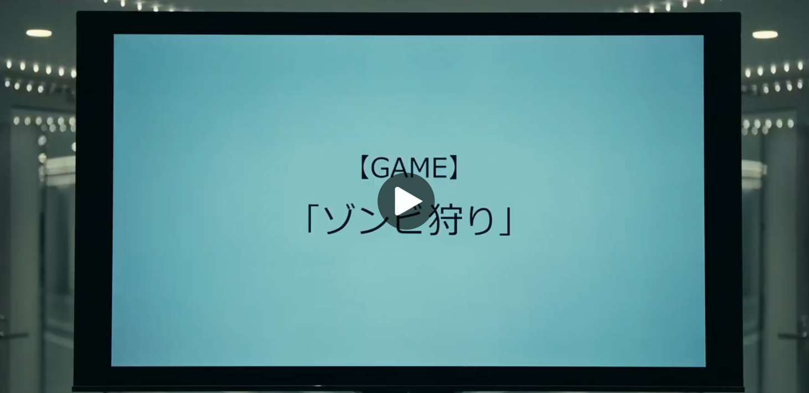
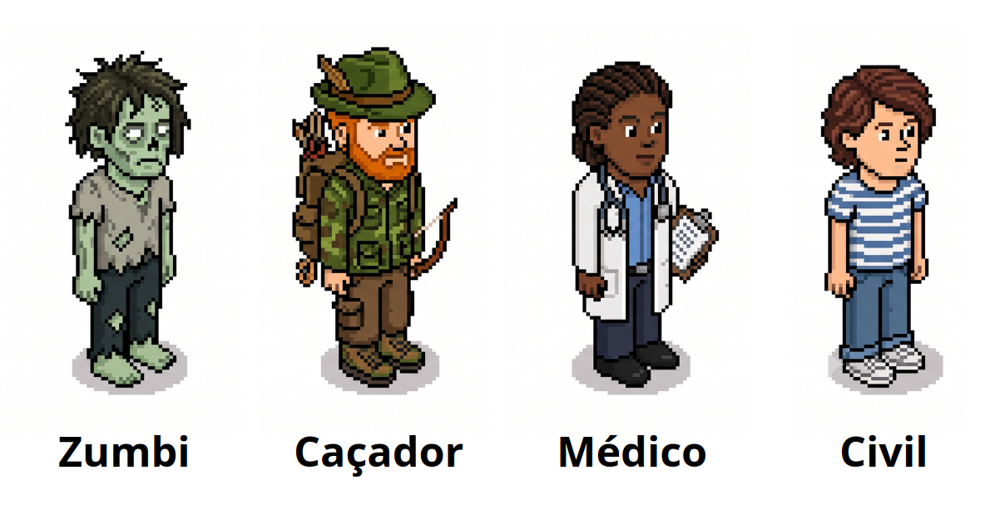

# 🧟 Zombie Hunt (P2P)
Repositório do projeto desenvolvido na disciplina Desenvolvimento de Sistemas de Informação Distribuídos | EACH USP (2026). O projeto trata-se de um jogo multiplayer inspirado no jogo “Zombie Hunt” da série Alice in Borderland, implementado em arquitetura peer-to-peer, no qual os jogadores se conectam diretamente sem servidor central.

## 🃏 Dinâmica do Jogo
Nosso projeto se baseia nas regras do jogo Zombie Hunt, como explicadas no episódio 2 da 3ª terporada de Alice in Borderland.

Um número N de participantes se conectam simultaneamente. Para cada participante é sorteado um papel no início do jogo: **Zumbi**, **Caçador**, **Médico** ou **Civil**, que deve ser mantido em segredo. Cada jogador inicia com um deck de cartas numeradas de 1 a 10. A cada rodada, uma dupla de jogadores é sorteada para batalharem entre si. A batalha consiste na escolha de uma carta de seu deck, vence o jogador que lançar a carta de maior valor. As possibilidades de ataque são:

- **Zumbi vence de Humano (Caçador/Médico/Civil)** → O Humano se torna um zumbi.
- **Caçador vence de Zumbi** → O zumbi morre.
- **Médico vence de Zumbi** → O zumbi se torna Civil.
- **Civil vence qualquer um (Zumbi/Médico/Caçador/Civil)** → Nada acontece, ambos permanecem vivos.
- **Caçador vence outro Humano (Médico/Civil)** → O Médico/Civil morre.
- **Médico vence outro Humano (Civil/Caçador)** → Nada acontece, ambos permanecem vivos.
- **Dois jogadores do mesmo papel se enfrentam** → O perdedor perde apenas a carta jogada. (exemplo: Zumbi vs Zumbi ou Caçador vs Caçador resulta apenas em perda de carta).

Caso ambos joguem cartas do mesmo valor, ninguém vence a rodada, apenas perdem do deck a carta lançada. Ao final de cada rodada, é revelado a todos o número de zumbis e humanos vivos. A partida termina quando um time tiver dizimado completamente o outro ou ao final de 10 rodadas, quando todos os jogadores já usaram todas as suas cartas. O time que tiver mais sobreviventes (Humanos vs. Zumbis), vence.

  

---

## 🏗️ Arquitetura
- **Arquitetura:** O sistema seguirá o modelo peer-to-peer (P2P), ou seja, sem servidor central. Cada jogador atua como cliente e servidor ao mesmo tempo. Usaremos uma arquitetura **P2P não-estruturada** com uma topologia de rede de **Full mesh/malha completa**, ou seja, durante o jogo todos os peers se conectam diretamente com todos. Para implementar isso usaremos uma tabela para guardar os dados e status dos outros peers da rede.
- **Arquitetura de Software:** Dividiremos em módulos:
    - **Jogador** → Classe contendo atributos e métodos do jogador (id, papel, deck de cartas, etc)  
    - **Jogo** → Lógica do jogo
    - **Rede** → Logica de conexão e comunicação entre peers (sockets TCP, threads, envios de JSON e timeouts)

## 🗣️ Comunicação
- **Tipo de comunicação:** TCP para garantir a entrega das mensagens.
- Envio das mensagens pela rede será **assíncrono**, ou seja, não bloqueante.
- Usaremos **conexões duradouras** entre os nós durante toda a partida.
- O **formato de mensagens** entre os peers (estado do jogo, ataque, etc) será **JSON**.

## 🧵 Processos
- Usaremos **threads** no módulo de rede para ficar escutando todas as mensagens enviadas pela rede.
- Servidores (os peers) serão **stateful**, ou seja, guardam memória sobre as conexões e estado do jogo.

## 🕑️ Coordenação
- Vamos usar o método de **sincronização de barreira** para **sincronizar** os resultados das batalhas ao final de cada rodada, garantindo que o jogo só passa pra rodada 2 depois que todos terminarem os duelos da rodada 1.
- Para a eleição do líder, utilizamos o princípio de que, quando um processo percebe que o coordenador não está mais respondendo, ele inicia uma eleição. Implementamos uma versão simples onde todos conhecem os IDs de todos os processos no sistema, e o processo vivo com o menor ID (maior prioridade na nossa regra) assume como novo coordenador.

## ☝️ Nomeação
- Os **nós (jogadores)** devem ser nomeados. Usaremos **nomeação plana**, identificando os jogadores com um **ID** associado a seu **endereço de IP e porta**.
- Para resolução de nomes, como a rede é pequena e Full Mesh (todos conhecem todos), usaremos uma tabela simples para associar ID e endereço do peer.
- **Descoberta de Peers**: Para a inicialização da rede, utilizaremos o modelo de **nó anfitrião**. Um dos jogadores inicia como anfitrião recebendo as conexões iniciais, ele será o ID 0. Os outros jogadores se conectam inicialmente apenas ao IP do anfitrião. Ao iniciar a partia, o anfitrião envia um JSON para todos contendo a tabela com a lista completa de IPs, portas e IDs de todos os conectados. A partir daí, os nós usam a lista para abrir conexões TCP diretas entre si, formando a malha P2P e dispensando o anfitrião de qualquer papel especial no jogo.

## 👬 Replicação e Consistência
- O estado do jogo é **completamente replicado** em todos os nós, ou seja, todos têm uma copia exata do estado do jogo.
- Para manter os **papéis em segredo sem violar a replicação**, cada peer criptografa seu papel inicial com uma palavra secreta (senha) e distribui o dado criptografado para a rede. *O estado é replicado para todos, mas só é descriptografado localmente pelos outros peers quando um jogador morre, se transforma, ou precisa revelar seu papel durante a resolução de uma batalha.*
- Para garantir a **consistência**, ao final de cada rodada, todos os peers trocam informações de quem morreu ou está vivo. Todos devem atualizar suas informações antes da próxima rodada começar.
- 

## 🚧 Tolerância a falhas
- O sistema tolerará Falhas de parada (crash): situações em que um componente para de funcionar bruscamente (como um usuário fechando o jogo), mas funcionava corretamente até parar.
- Detecção de Falhas por Sondagem: Como uma detecção de falhas puramente baseada em tempo de resposta do usuário prejudicaria a dinâmica do jogo, o sistema adotará a técnica de sondagem (Probing). Periodicamente, um processo $P$ envia uma requisição "PING" ao processo $Q$ esperando uma reação TCP. Se $Q$ não reagir à sondagem (timeout de rede super curto, indicando que a porta TCP do processo não está mais ouvindo), então $Q$ é suspeito de ter travado ou desconectado e é dado como eliminado. Isso permite que os jogadores levem o tempo que for necessário para escolherem suas cartas sem travar a barreira global.
- Caso o oponente caia no meio do duelo, a falha é detectada pela sondagem e a vitória é decretada por WO, sendo repassada ao Líder da rodada.
- Para proteger o sistema contra Falhas arbitrárias e maliciosas (Bizantinas), aplicaremos técnicas de criptografia visando proteger a integridade dos dados durante os duelos.
- O duelo implementa o protocolo de compromisso (Commit-Reveal) baseado em Funções de Hash.
- A jogada é processada em uma função hash segura gerando uma cadeia de tamanho fixo, de forma que qualquer mudança na carta gere uma saída completamente diferente (resistência à colisão). É computacionalmente inviável deduzir a carta escolhida a partir do hash exposto antes do final da rodada

<!--

## 📦 Dependências de software

#### Backend
- Python

#### Frontend
- [...]

-->
---

## 👨‍💻 Autores
 
- [Stefanie Santos](https://github.com/stepalmeira)
- [Pedro Nunes](https://github.com/pedr0nunes)